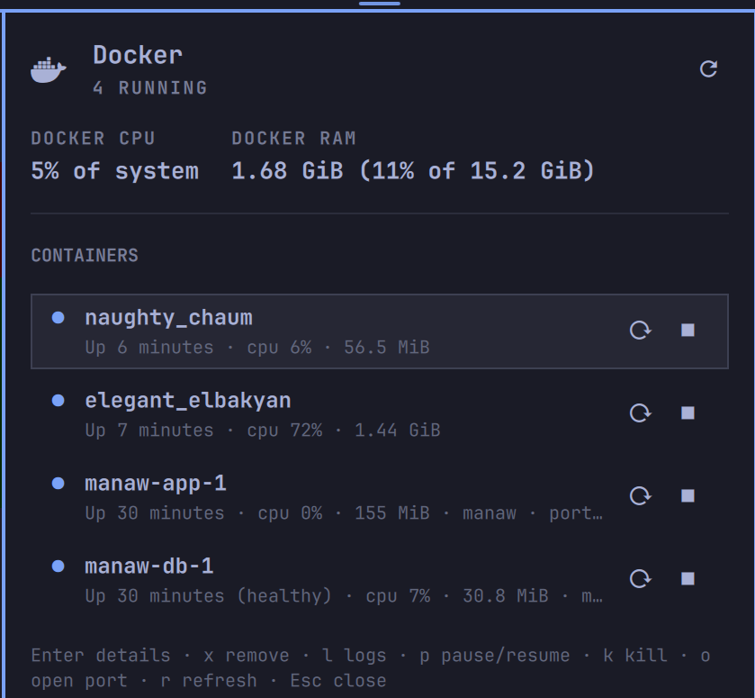

# Docker

**The last Docker widget you'll install.** Everything you actually do to a
container is one click away in the bar — and nothing you don't.

An [Omarchy](https://omarchy.org/) bar plugin for Docker. It does the
everyday things — start, stop, restart, pause and remove containers, read
their logs, open a shell, watch live CPU and RAM per container and in
total — and nothing else. No VM support, no RDP sessions, no daemon it
tries to fix for you, no privileges it asks you for: one whale icon, one
popup, the docker commands you'd otherwise be typing by hand.

## What it gives you

- **Grouped by compose project.** Containers collapse under the compose
  project that created them, each header showing the project's state and
  combined CPU/RAM, with Start, Restart and Stop for the whole project and
  an Edit button that opens its compose files in your editor. Expand a
  project for the same per-container controls as before.
- **A list you can act on without a second click.** Stop and Restart (or
  Start) sit right on the row. Removing is behind a confirmation that starts
  on Cancel, and only ever appears where docker will actually allow it —
  nothing running, paused, or restarting can be removed.
- **Live CPU and RAM, always on.** Every active row shows its own usage;
  the header shows a total normalized against the whole machine — CPU
  against every core, RAM against the machine's own total — so the number
  means "how much of this machine Docker is using", not just a raw sum.
- **More options behind a click.** Expand a row for its image, published
  ports, logs, a shell, pause/kill, and one button per published port. Logs
  and the shell open in a terminal window rather than inside the popup.
- **Follows docker's own state machine, not a running/stopped guess.** A
  paused container is never offered Start (which cannot resume it) — only
  Unpause. A container stuck in a restart loop is coloured as active, not
  read as stopped.
- **Nothing persisted.** No `Service.qml`, no state written to disk —
  every number on screen came from a docker call made a few seconds ago.
- **Keyboard everything.** The popup never needs the mouse.



## Install

```bash
omarchy plugin add https://github.com/Majkelll/omarchy-docker.git --enable
```

Click the whale icon in the bar. There is nothing to configure by hand
first — it reads straight from the docker daemon your user already has
access to.

### Removing it

```bash
omarchy plugin remove io.github.majkelll.omarchy-docker
```

That unloads the widget and deletes the plugin. Nothing is written outside
the plugin's own directory, so there is nothing else to clean up — your
containers, images, and volumes are never touched by removing the plugin.

## Compose projects

Containers are grouped by their `com.docker.compose.project` label — the
one `docker compose` stamps on everything it creates — rather than by a
guessed name prefix. Projects are listed alphabetically and start
collapsed; containers without a project are listed after them on their own.
Turn grouping off with the `groupByProject` setting to get the flat list
back.

A project header shows a summary of its containers' states
("4 restarting · 6 stopped") and their combined CPU/RAM, and offers:

| | |
|---|---|
| **▶ button** | Start all — `docker compose -p <project> start`, shown while anything in the project is stopped |
| **↻ button** | Restart all — `docker compose -p <project> restart`, shown while anything is up |
| **■ button** | Stop all — `docker compose -p <project> stop`, shown while anything is up |
| **✎ button** | Edit — open the project's compose files in your default editor |
| **Click the header** | expand or collapse the project |

These act on the containers the project already has, found by label, so
they need neither the compose file nor the environment the project was
brought up with, and nothing is recreated or removed: this is start/stop,
not `up`/`down`. Compose still applies its own dependency order. The
helper runs compose from `/` with `COMPOSE_FILE` cleared, so a compose file
lying around in the shell's working directory can never stand in for the
project.

Edit opens the files compose itself recorded when the project was brought
up — the `com.docker.compose.project.config_files` label, so a base
`compose.yaml` and every overlay passed with `-f` open together — in
Omarchy's default editor (`omarchy-launch-editor`, falling back to
`xdg-open`). Only absolute paths to files that still exist are opened; if
none are left, the panel says so instead.

## The container list

Click the whale icon in the bar to open the popup. It shows the total
CPU/RAM line, then the projects, then one row per standalone container:

| | |
|---|---|
| **↻ button** | Restart |
| **■ button** | Stop |
| **▶ button** | Start — shown instead of Restart/Stop for a container that isn't running |
| **🗑 button** | Remove — only where docker will allow it (`created`, `exited`, `dead`), behind a confirmation |
| **Click the row** | expand it |

### Expanded row

The image, published ports, and the actions that don't earn a permanent
button:

| Action | Shown when |
|---|---|
| View logs | always — `docker logs -f --tail 200`, opened in a terminal that waits for a key before closing, so a stopped container's logs stay readable instead of flashing past |
| Open a shell | the container is running — `docker exec -it`, bash if it's there, `sh` otherwise |
| Pause / Resume | running / paused |
| Kill now | running or restarting |
| Open 127.0.0.1:*port* | one entry per published port, while the container is running — a published port survives a stop, but nothing would be listening on it |

## CPU and RAM

The container list and the CPU/RAM sample are two separate docker calls on
two separate timers. `docker stats` waits about two seconds for a sample
regardless of how many containers exist, against roughly sixty
milliseconds for the list — sharing one timer between them would make the
list feel like it hangs. The stats timer only runs while the popup is
open.

The header's total isn't a raw sum of docker's own per-container
percentages: docker's `CPUPerc` is relative to a single core, so a handful
of busy containers on an eight-core machine could otherwise read several
hundred percent. It's normalized against every core instead, so it reads
as "how much of this machine", the same way a task manager's overall CPU
number would.

## Removing a container

Only offered where docker itself would allow it — a running, paused, or
restarting container never shows the button. The confirmation dialog names
the container, starts on **Cancel**, and runs a plain `docker rm` —
never `-f`, never `-v` — so the image and every volume survive. Recreating
the container over the same volume gets it back.

## Keyboard

| Key | Does |
|---|---|
| `↑` `↓` / `j` `k` | move between projects and containers |
| `→` / `l` | expand the selected project |
| `←` / `h` | collapse the selected project, or jump from a container to its project |
| `Enter` | expand the selected project or container |
| `u` | up: start the selected project or container |
| `d` | down: stop the selected project or container |
| `e` | edit the compose files of the selected project, or of the selected container's project |
| `x` | ask to remove the selected container |
| `L` | view its logs |
| `p` | pause or resume it |
| `K` | kill it |
| `o` | open its first published port |
| `r` | refresh the list now |
| `Esc` | close the popup, or cancel a confirmation |

While the remove confirmation is up it owns the keys: left/right switch the
answer, `Enter` takes it, `Esc` cancels.

## Commands

Every action is scriptable, which is what makes it bindable to a key:

```bash
omarchy-shell io.github.majkelll.omarchy-docker toggle             # open or close the popup
omarchy-shell io.github.majkelll.omarchy-docker list                # a one-line summary, e.g. "3 running · 1 stopped"
omarchy-shell io.github.majkelll.omarchy-docker refresh             # refresh the list now
omarchy-shell io.github.majkelll.omarchy-docker start|stop|restart <name>
omarchy-shell io.github.majkelll.omarchy-docker pause|unpause|kill <name>
omarchy-shell io.github.majkelll.omarchy-docker startGroup|stopGroup|restartGroup <project>
omarchy-shell io.github.majkelll.omarchy-docker editGroup <project>    # opens its compose files in your editor
omarchy-shell io.github.majkelll.omarchy-docker remove <name>       # opens the popup and asks — never deletes outright
omarchy-shell io.github.majkelll.omarchy-docker logs <name>         # opens a terminal with the container's logs
omarchy-shell io.github.majkelll.omarchy-docker shell <name>        # opens a terminal shell in the container
```

`remove` never skips the confirmation dialog — it puts the popup on screen
and asks, exactly like a click on the row's own button, so a keybinding
can't delete a container without a second step either.

In `~/.config/hypr/bindings.conf`:

```
bindd = SUPER SHIFT, D, Docker, exec, omarchy-shell io.github.majkelll.omarchy-docker toggle
```

## Settings

Set these on the widget's entry in `~/.config/omarchy/shell.json`, or
through Setup > Plugins.

| Key | Default | Meaning |
|---|---|---|
| `listRefreshSec` | `5` | List refresh cadence while the popup is open. Closed, it backs off to 30s. |
| `statsRefreshSec` | `10` | CPU/RAM sample cadence while the popup is open. Not sampled at all while closed. |
| `stopTimeoutSec` | `10` | Seconds docker may spend on a clean shutdown before it kills the container. Also used for project stop/restart. |
| `groupByProject` | `true` | Group containers under their compose project. Off lists every container on its own. |

## Requirements

- [Omarchy](https://omarchy.org/) with `omarchy-shell` (the Quickshell bar).
- `docker` with the compose plugin (`docker compose`) for project actions,
  with your user already able to run it without sudo. That
  usually means membership in the `docker` group:
  `sudo usermod -aG docker $USER`, then a full log out and back in (a plain
  `newgrp` in one terminal isn't enough — `omarchy-shell` keeps the group
  membership it had when it started).
- `omarchy-launch-terminal` for logs and shells, and optionally
  `omarchy-launch-browser` (or `xdg-open`) for opening a published port —
  both ship with a base Omarchy install.

## Privileges and security

- **No sudo, no pkexec, no polkit.** Every docker call is the plain
  `docker` CLI run as your user. If it can't reach the daemon or the socket
  refuses your user, the popup says which and does nothing else.
- Membership in the `docker` group is effectively root on the host — that's
  a property of docker itself, not of this plugin, but it's the privilege
  boundary this widget sits on. This plugin never tries to grant it or
  start the daemon for you.
- **Every docker read is bounded while it is read**, so a host with a
  pathological number of containers, or one with a pathological name,
  cannot grow the long-running shell process: each call is capped in bytes
  and rows before it's parsed, in the helper script and again in `Model.js`.
- **Removal is narrow by construction**: only `created`, `exited`, or `dead`
  containers, plain `docker rm`, behind a confirmation dialog that starts on
  Cancel.
- **Edit only opens what compose recorded.** The compose-file label is
  free-form text anyone can set, so only absolute paths to existing regular
  files are passed to the editor — as arguments, never through a shell.
- **Nothing is fetched at runtime.** No network calls, no telemetry — every
  action is a local `docker` invocation, or a terminal or editor launch.

## Layout

```
manifest.json           plugin manifest (bar-widget, entry point, settings schema)
BarWidget.qml            bar icon + owns every docker read/write, no Service.qml
Panel.qml                the popup
Model.js                 parsing, per-state action rules, and formatting — no QML types
bin/omarchy-docker-ctl   every docker call, in one place
```

`bin/omarchy-docker-ctl` is a plain script and the place to look when
something misbehaves — run it directly:

```bash
~/.config/omarchy/plugins/io.github.majkelll.omarchy-docker/bin/omarchy-docker-ctl list
~/.config/omarchy/plugins/io.github.majkelll.omarchy-docker/bin/omarchy-docker-ctl stats
~/.config/omarchy/plugins/io.github.majkelll.omarchy-docker/bin/omarchy-docker-ctl group files <project>
```

`list` prints one line per container (name, image, state, status, compose
project, health, restart count, published ports); `stats` prints a leading
metadata line (core count, total system RAM) followed by one line per
running container; `group files` prints the compose files the Edit button
would open, one per line.

## Development

```bash
ln -s "$PWD" ~/.config/omarchy/plugins/io.github.majkelll.omarchy-docker
omarchy-shell shell rescanPlugins
omarchy plugin enable io.github.majkelll.omarchy-docker right
```

Saving a file under `~/.config/omarchy/plugins/` usually reloads the plugin
automatically. If an edit doesn't show up — Quickshell's QML engine can keep
serving an already-compiled version of a file from memory — run
`omarchy restart shell`, which also clears the on-disk QML cache.

The parsing, state rules, and formatting live in `Model.js`, free of Qt, so
they run under Node:

```bash
node tests/model.test.js
```

`.github/workflows/tests.yml` runs those on every push, plus the helper
script against a real docker daemon (`ubuntu-latest` ships one) so its
`list`/`stats` output and every lifecycle action are exercised for real.

## License

MIT. See [LICENSE](LICENSE).
